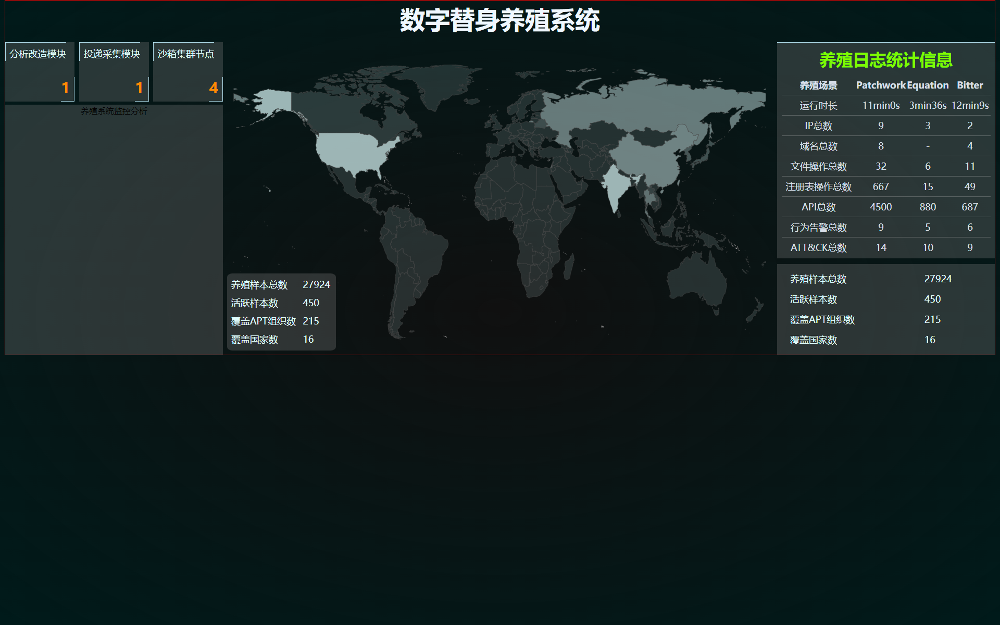

## 启动

` npm install `

` npm run dev `

## 目录

### components对应文件: 

1. LogStatInfo:  
   - 养殖日志统计信息。
   - 目前位置：右上角，紧贴上边缘，高度69%。
2. SampleInfoCount：
   - 养殖日志统计信息-1。
   - 

### 进度

- 世界地图：目前配置为鼠标移动到对应国家上面时显示当前该国家名称以及样本数

#### 20240329：

这个分支上是最开始的版本，1920*1080，目前为中心布局，居中展示，当前界面如下：

